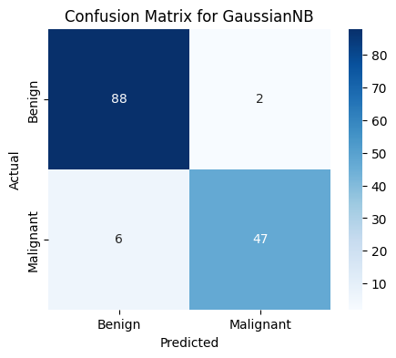
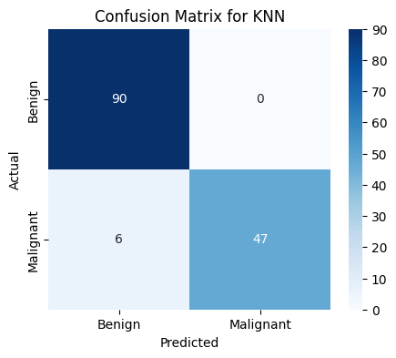
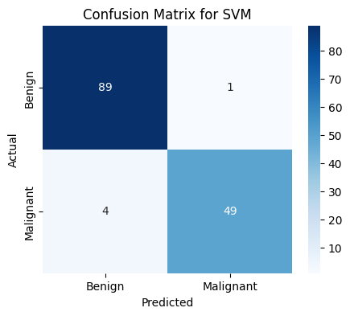

# Breast Cancer Classification 🧬

This project aims to classify breast cancer tumors as **Malignant** or **Benign** using machine learning techniques. We utilize the Wisconsin Breast Cancer Dataset and compare the performance of three different classifiers.

## 🚀 Overview
Early diagnosis of breast cancer can significantly increase the chances of successful treatment. This repository provides a complete pipeline from data preprocessing to model evaluation and comparison.

## 🛠️ Tech Stack
* **Language:** Python 3.x
* **Libraries:** `Pandas`, `NumPy`, `Scikit-Learn`, `Matplotlib`, `Seaborn`

## 📊 Models Implemented
The project evaluates three main algorithms, using **GridSearchCV** to find the optimal hyperparameters:
1. **Gaussian Naive Bayes (GNB)**
2. **K-Nearest Neighbors (KNN)**
3. **Support Vector Machine (SVM)**

## 📂 Project Structure
* `breast.csv`: The raw dataset used for training and testing.
* `Breast_Cancer.ipynb`: Jupyter notebook containing the full analysis and code.
* `LICENSE`: MIT License information.
## 📊 Results & Visualizations

### 1. Model Comparison Accuracy
This chart shows the performance comparison between the models:


### 2. Confusion Matrices
Detailed performance for each classifier:

| GaussianNB | KNN | SVM |
| :---: | :---: | :---: |
|  |  |  |
## ⚙️ How to Run
1. Clone the repository to your local machine.
2. Install the required libraries:
   ```bash 
   pip install pandas scikit-learn seaborn matplotlib
3. Open Breast_Cancer.ipynb in Jupyter Notebook or VS Code and run all cells. 
